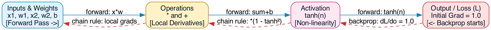
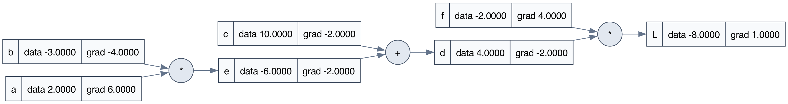
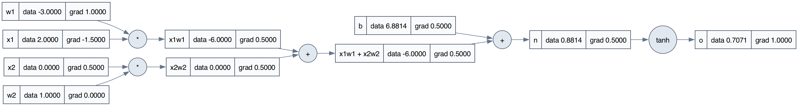

# 🧠 Neural Networks & Micrograd From Scratch

A lightweight, educational autograd engine and neural network library built from first principles in Python (inspired by Andrej Karpathy's *micrograd*). 

This project demystifies how modern deep learning frameworks (like PyTorch and TensorFlow) work behind the scenes by implementing a scalar-valued automatic differentiation engine, dynamic computational graph visualization, and backpropagation step-by-step.

---

## 📑 Table of Contents
- [Overview](#overview)
- [Core Concepts & Intuition](#core-concepts--intuition)
  - [1. The Derivative: Rise Over Run](#1-the-derivative-rise-over-run)
  - [2. The `Value` Class (Autograd Engine)](#2-the-value-class-autograd-engine)
  - [3. Computational Graph Visualization](#3-computational-graph-visualization)
  - [4. Backpropagation & The Chain Rule](#4-backpropagation--the-chain-rule)
  - [5. Artificial Neuron with $\tanh$ Activation](#5-artificial-neuron-with-tanh-activation)
- [Computational Graphs](#computational-graphs)
- [Project Structure](#project-structure)
- [Getting Started](#getting-started)
- [Key Takeaways](#key-takeaways)

---

## 🔍 Overview

At the heart of every neural network is an **autograd engine** that evaluates mathematical expressions, builds a directed acyclic graph (DAG) of all intermediate operations, and propagates gradients backward using the **multivariable chain rule**.

In this notebook ([`micrograd.ipynb`](micrograd.ipynb)), we build every piece of this engine from scratch without relying on any machine learning libraries:

```
[Inputs & Weights] ──(Forward Pass)──> [Operations & Activations] ──> [Loss / Output]
       │                                                                     │
       └──────────────(Chain Rule: Backward Pass / Gradients)───────────────┘
```



---

## 💡 Core Concepts & Intuition

### 1. The Derivative: Rise Over Run
Before diving into complex neural networks, we build an intuitive understanding of derivatives using standard calculus:

$$\frac{df}{dx} = \lim_{h \to 0} \frac{f(x + h) - f(x)}{h}$$

By testing a parabola $f(x) = 3x^2 - 4x + 5$ and nudging $x$ by a tiny value $h = 10^{-6}$, we observe:
- At $x = \frac{2}{3}$, the derivative evaluates to $\approx 0$, confirming the parabolic minimum.
- When perturbing multivariate functions $d(a, b, c) = a \cdot b + c$, nudging each input reveals how sensitive the output is to changes in each parameter.

---

### 2. The `Value` Class (Autograd Engine)
To automate gradient tracking, we wrap raw scalars in a custom `Value` object that records:
- `data`: The raw numerical scalar (floating point).
- `grad`: The derivative of the final loss $L$ with respect to this value ($\frac{\partial L}{\partial v}$), initialized to `0.0`.
- `_prev`: Pointers to the child `Value` objects that produced this node.
- `_op`: The mathematical operation symbol that generated it (`+`, `*`, `tanh`).
- `label`: A human-readable identifier for easy inspection and visualization.

```python
class Value:
    def __init__(self, data, _children=(), _op='', label=''):
        self.data = data
        self.grad = 0.0
        self._prev = set(_children)
        self._op = _op
        self.label = label

    def __repr__(self):
        return f"Value(data={self.data})"

    def __add__(self, other):
        other = other if isinstance(other, Value) else Value(other)
        out = Value(self.data + other.data, (self, other), '+')
        return out

    def __mul__(self, other):
        other = other if isinstance(other, Value) else Value(other)
        out = Value(self.data * other.data, (self, other), '*')
        return out

    def tanh(self):
        x = self.data
        t = (math.exp(2*x) - 1) / (math.exp(2*x) + 1)
        out = Value(t, (self, ), 'tanh')
        return out
```

---

### 3. Computational Graph Visualization
Using **Graphviz**, we dynamically trace backwards from any output node through its `_prev` pointers to draw the full Directed Acyclic Graph (DAG):
- **Rectangular Nodes**: Represent values showing `{ label | data | grad }`.
- **Circular Nodes**: Represent mathematical operations applied to produce child nodes.

```python
def trace(root):
    nodes, edges = set(), set()
    def build(v):
        if v not in nodes:
            nodes.add(v)
            for child in v._prev:
                edges.add((child, v))
                build(child)
    build(root)
    return nodes, edges
```

---

### 4. Backpropagation & The Chain Rule
Backpropagation calculates the sensitivity of the final output $L$ with respect to every intermediate variable by traversing the graph backwards.

For a composite expression:
$$e = a \cdot b$$
$$d = e + c$$
$$L = d \cdot f$$

#### Analytic Derivations (The Chain Rule):
1. **Base Case:** 
   $$\frac{\partial L}{\partial L} = 1.0$$
2. **Multiplication Node ($L = d \cdot f$):**
   $$\frac{\partial L}{\partial d} = f = -2.0 \quad \text{and} \quad \frac{\partial L}{\partial f} = d = 4.0$$
3. **Addition Node ($d = e + c$ - Gradient Distributor):**
   $$\frac{\partial L}{\partial c} = \frac{\partial L}{\partial d} \cdot \frac{\partial d}{\partial c} = -2.0 \cdot 1 = -2.0$$
   $$\frac{\partial L}{\partial e} = \frac{\partial L}{\partial d} \cdot \frac{\partial d}{\partial e} = -2.0 \cdot 1 = -2.0$$
4. **Input Nodes ($e = a \cdot b$):**
   $$\frac{\partial L}{\partial a} = \frac{\partial L}{\partial e} \cdot \frac{\partial e}{\partial a} = -2.0 \cdot b = -2.0 \cdot (-3.0) = 6.0$$
   $$\frac{\partial L}{\partial b} = \frac{\partial L}{\partial e} \cdot \frac{\partial e}{\partial b} = -2.0 \cdot a = -2.0 \cdot 2.0 = -4.0$$



> **Numerical Verification (`lol()` function):**
> We verify every analytical gradient numerically by adding a tiny nudge $h = 0.001$ to a single variable and measuring $\frac{\Delta L}{h}$. The analytical and numerical results match exactly!

---

### 5. Artificial Neuron with $\tanh$ Activation
Next, we model a biological/artificial neuron receiving multiple inputs:

$$n = \sum_{i} x_i w_i + b = (x_1 w_1 + x_2 w_2) + b$$
$$o = \tanh(n)$$



#### Tanh Activation Function
$$\tanh(x) = \frac{e^{2x} - 1}{e^{2x} + 1}$$

The derivative of $\tanh(x)$ is elegantly computed from its forward value:
$$\frac{d}{dx}\tanh(x) = 1 - \tanh^2(x)$$

Applying the chain rule through the neuron:
- $\frac{\partial o}{\partial o} = 1.0$
- $\frac{\partial o}{\partial n} = 1 - \tanh^2(n) = 1 - (0.7071)^2 \approx 0.5$
- Since $n = (x_1 w_1 + x_2 w_2) + b$, the gradient $0.5$ flows directly into $b$ and the weighted sum!
- The gradients with respect to the weights $w_1$ and $w_2$ are scaled by their inputs:
  $$\frac{\partial o}{\partial w_1} = \frac{\partial o}{\partial n} \cdot x_1 = 0.5 \cdot 2.0 = 1.0$$
  $$\frac{\partial o}{\partial w_2} = \frac{\partial o}{\partial n} \cdot x_2 = 0.5 \cdot 0.0 = 0.0$$

---

## 📁 Project Structure

```
neural-networks/
├── assets/
│   ├── backprop_flow.png              # High-level backpropagation pipeline diagram
│   ├── basic_computation_graph.png   # Graphviz diagram of expression L = ((a*b) + c)*f
│   ├── neuron_computation_graph.png  # Graphviz diagram of 2-input neuron with tanh
│   └── *.svg                          # Vector versions of all diagrams
├── micrograd.ipynb                    # Complete interactive Jupyter notebook
├── .gitignore                         # Standard git ignore rules (venv, cache, checkpoints)
└── README.md                          # Project documentation
```

---

## 🚀 Getting Started

### 1. Clone the repository
```bash
git clone https://github.com/Luciferxy/neural-networks.git
cd neural-networks
```

### 2. Install dependencies
```bash
# Python dependencies
pip install numpy matplotlib graphviz

# System Graphviz binary (macOS)
brew install graphviz

# (Ubuntu / Debian alternative)
# sudo apt-get install graphviz
```

### 3. Launch Jupyter
```bash
jupyter notebook micrograd.ipynb
# or open directly inside VS Code / Antigravity IDE
```

---

## 🎯 Key Takeaways
1. **Derivatives dictate optimization**: A positive gradient means increasing the input increases the output; a negative gradient means increasing the input decreases the output.
2. **Backpropagation is just chain rule recursively applied**: Each node only needs to compute its *local derivative* and multiply it by the incoming gradient from upstream.
3. **Graphviz makes autograd transparent**: Seeing the flow of forward data alongside backward gradients provides immediate intuition for debugging neural network topologies.
